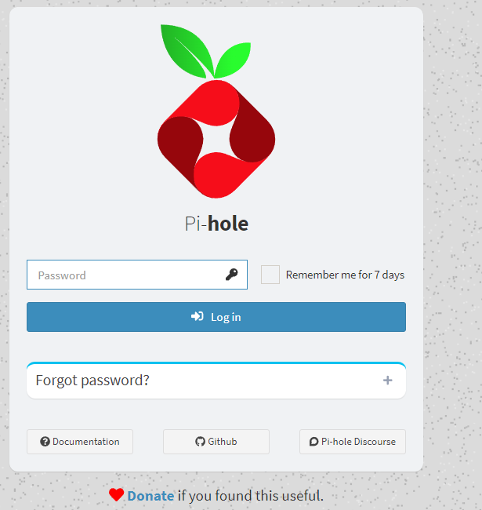
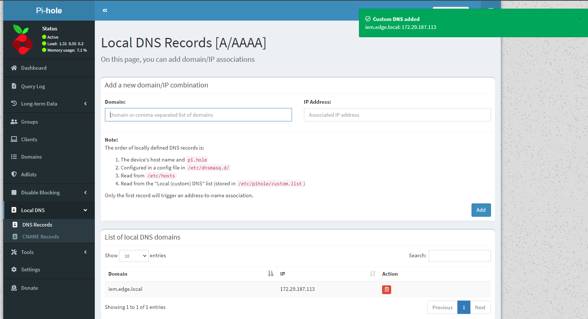

# Instalação do Servidor de DNS Pi-hole

## Executar o `docker-compose.yml` na pasta `dns-server`

```
cd dns-server
docker compose up -d
```

## Erro: porta 53 em Uso

Caso a porta 53 esteja em uso (Linux), provavelmente é devido ao `systemd-resolved`. 
Verifique o [tutorial de como liberar a porta 53](port-in-use.md)

## Com o Pi-hole funcionando, caso queira, defina a senha (a padrão é `1234`)

```
docker exec -it pihole pihole -a -p
```



## Abra a url: [http://localhost/admin/](http://localhost/admin/)

No pihole, ir em Local DNS e adicionar os registros para o IEM e para o IED.

O IP do IED aparece no prompt da VM.

O IP do IEM é o IP do WSL (use o ifconfig para verificar)


